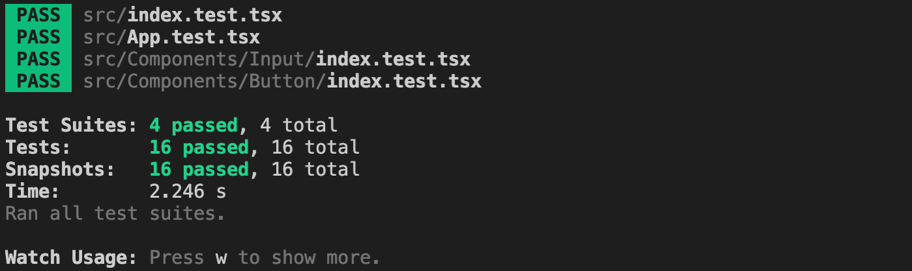

# [TTD on Front-end (React.js)](https://github.com/SPONGE-JL/CrashLab-CleanCode/wiki/Chapter-09.-Unit-Tests-Part.2-TDD-on-Front-end-(React.js))

## Purpose

2021년 말 현재, 세계적으로 Front-end 영역에서 가장 많이 사용되는 언어는 단연코 자바스크립트이며,
**SPA**(Single Page Architecture) 혹은 **SSR**(Server Side Rendering)에서 채택 가능한 렌더링 엔진으로
**`React.js`** 가 가장 많이 사용되고 있습니다.

React.js는 기본적으로 Node.js 환경에서 동작하는 엔진 라이브러리이기 때문에, Node.js에서 널리 사용되는 테스트 도구를 사용하면 보다 쉽게 TDD를 적용할 수 있습니다.
다양한 테스트 도구들 중에서도 **`Jest.js`** 를 이용해서 React환경에서의 TDD 실습을 진행합니다.
(Jest.js는 Next.js, Nuxt.js, Angular 등의 대표 프레임워크에서 널리 적용된 표준 테스트 라이브러리입니다.)

<p align="center">
  <a target="_blank" href="https://reactjs.org/">
    
  </a>
  &nbsp;
  <a target="_blank" href="https://jestjs.io/">
    
  </a>
</p>

## Test cycle

### 1. 실제 코드는 작성없이 테스트 수행 내역을 코드로 작성하기

Init [`src/Components/Input/index.test.tsx`](./src/Components/Input/index.test.tsx):

```typescript
import React from 'react';
import { render, screen } from '@testing-library/react';
import 'jest-styled-components';

import { Input } from './index'; // compire error

describe('<InputBox />', () => {
  it('should render its components', () => {
    const { container } = render(<Input placeholder="This is an InputBox." />);

    const input = screen.getByDisplayValue('This is an InputBox.');
    expect(input).toBeInTheDocument();
    expect(input).toMatchSnapshot();
    
    expect(container).toMatchSnapshot();
  });
});
```

<details>
<summary>in vscode</summary><br>


</details>

```bash
yarn test --watchAll
```

<details>
<summary>in terminal</summary><br>


</details>

### 2. 테스트 결과는 실패하지만 컴파일에 문제가 없도록 실제 코드 작성하기

Init [`src/Components/Input/index.tsx`](./src/Components/Input/index.tsx):

```typescript
import React from 'react';
import Styled from 'styled-components';

const Input = Styled.input``;

export const InputBox = () => {
  return <Input />;
};
```

<details>
<summary>in vscode</summary><br>


</details>

<details>
<summary>in terminal</summary><br>


</details>

### 3. 실제 코드를 수정해서 테스트를 통과시키기

Edit [`src/Components/Input/index.tsx`](./src/Components/Input/index.tsx):

```typescript
import React from 'react';
import Styled from 'styled-components';

const InputBox = Styled.input``;

export const Input = ({ placeholder }: { readonly placeholder?: string }) => {
  return <InputBox placeholder={placeholder} />;
};
```

<details>
<summary>in vscode</summary><br>


</details>

<details>
<summary>in terminal</summary><br>


</details>

### 4. 리팩토링

Refactor [`src/Components/Input/index.tsx`](./src/Components/Input/index.tsx):

```typescript
import React from 'react';
import Styled from 'styled-components';

//- Sytled Component
const InputBox = Styled.input``;

//- React Component
interface Props {
  readonly placeholder?: string;
}

export const Input = ({ placeholder }: Props) => {
  return <InputBox placeholder={placeholder} />;
};
```

Refactor [`src/Components/Input/index.test.tsx`](./src/Components/Input/index.test.tsx):

```typescript
import React from 'react';
import { render, screen } from '@testing-library/react';
import 'jest-styled-components';

import { Input } from './index';

describe('<Input />', () => {
  it('should render its components', () => {
    const { container } = render(<Input placeholder="This is an Input tag." />);
    expect(container).toMatchSnapshot(); // capture

    const input = screen.getByPlaceholderText('This is an Input tag.');
    expect(input).toBeInTheDocument();
    expect(input).toMatchSnapshot(); // capture
  });
});

```

<details>
<summary>in vscode</summary><br>


</details>

<details>
<summary>in terminal</summary><br>

Initial Pass:


Rerun (Pass):


</details>

<details>
<summary>in directory</summary><br>


</details>

## Practice

### Test Targets

1. **React DOM**: [Index Test](./src/index.index.test.tsx) && [Index](./src/index.tsx#L7-L12)

    

2. **React Components**:
   1. **Style Rules**: [Input Test](./src/Components/Input/index.test.tsx#L8-L20) & [Input](./src/Components/Input/index.tsx#L5-L14)
   2. **Component Tree**: [Button Test](./src/Components/Button/index.test.tsx#L8-L27) & [Button](./src/Components/Button/index.tsx#L37-L43)
   3. **Props**: [Input Props Test](./src/Components/Input/index.test.tsx#L30-L57) & [Input](./src/Components/Input/index.tsx#L17-L36)
   4. **State**: [App Test](./src/App.test.tsx#L22-L36) & [App](./src/App.tsx#L44)
      

3. **Other Functions**
   1. Contained-Logic: ex. Function Call
   2. Dependent-Logic: ex. API Call

### How to run

```bash
# Install Dependencies
yarn install
# or | npm install

# Unit Test
yarn test
# or | npm run test

# Check Test Coverage
yarn test --coverage --watchAll
# or | npm run test -- --coverage --watchAll
```

---

## Project Dependencies

### Typescript Complier: `tsconfig.json`

- To use absolute pakage path in import sytanx, [set 'baseUrl'.](./tsconfig.json#L3)

#### Prettier Hooking

```bash
yarn add --dev husky lint-staged prettier
```

- `.prettierrc.js`: [basic prettier policy](./.prettierrc.js)
- `package.json`: [add husky hook for uing prettier](./package.json#L5-#L14)

#### CSS & Test

```bash
yarn add styled-components
yarn add --dev @types/styled-components jest-styled-components
```
