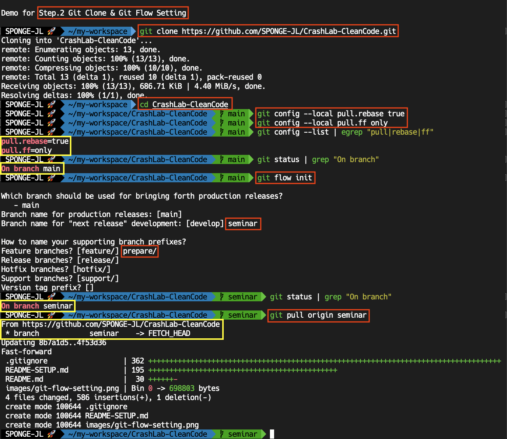
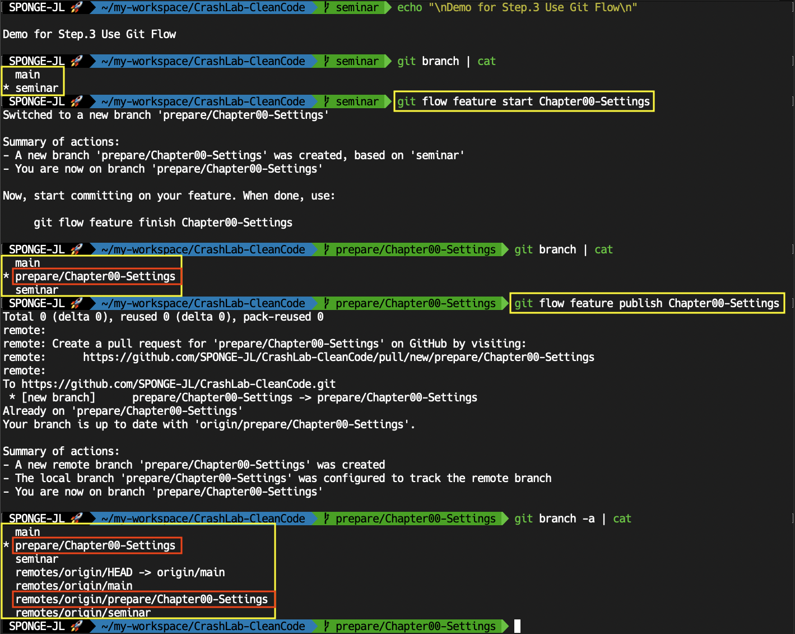
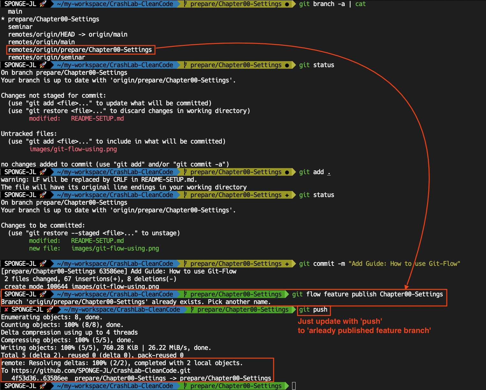

# Set-up Guide for Contributors

> **NOTICE**  
> This guide has been written for MacOS users.

- [How to use](./README-SETUP.md#how-to-use)
- [Prerequisites](./README-SETUP.md#prerequisites-for-macos)

---

# How to use

## 1. check [prerequisites](./README-SETUP.md#prerequisites-for-macos).

## 2. Git Clone & Git Flow Setting

- **Understand [git-flow](http://danielkummer.github.io/git-flow-cheatsheet/).**

- Clone Repository to your Mac.

  ```bash
  git clone https://github.com/SPONGE-JL/CrashLab-CleanCode.git
  ```

- Setting Local Config for [Rebase & Fast-Forward](https://backlog.com/git-tutorial/kr/stepup/stepup1_4.html).

  ```bash
  cd CrashLab-CleanCode
  git config --local pull.rebase true
  git config --local pull.ff only

  # Check
  git config --list | egrep "pull|rebase|ff"
    # Like below ... 
    # pull.rebase=true    >> Set pulling strategy into 'rebase' not 'merge'.
    # pull.ff=only        >> Set fast-forward only
  ```

-  Setting Git-Flow

  ```bash
  # Check Current Branch
  git status | grep "On branch"
    # Like below ...
    # On branch main
  
  # Start Git-Flow
  git flow init
    # Like below ..
    # Which branch should be used for bringing forth production releases?
    #    - main
    # Branch name for production releases: [main]                   << ENTER
    # Branch name for "next release" development: [develop] seminar << TYPE 'seminar'
    #
    # How to name your supporting branch prefixes?
    # Feature branches? [feature/] prepare/  << TYPE 'prepare/'
    # Release branches? [release/]           << ENTER
    # Hotfix branches? [hotfix/]             << ENTER
    # Support branches? [support/]           << ENTER
    # Version tag prefix? []                 << ENTER
  
  # Check Current Branch has been switched
  git status | grep "On branch"
    # Like below : Switched to 'semonar' branch for merging developed feautres (name by 'chapter')
    # On branch seminar

  # Pull
  git pull origin seminar
  ```



## 3. use Git Flow

- Switch to 'seminar' branch with updating.

  ```bash
  # Check branch list
  git branch | cat
    # Maybe like below...
    #   main
    # * seminar
    #   (other prepare branches could exist)

  git checkout seminar
    # If you see like this, the seminar branch is latest state
    # Already on 'seminar'
    # Your branch is up to date with 'origin/seminar'.
    
  # If it isn't up-to-date, pull from remote.
  git pull origin seminar
  ```

- Start to prepare your leading-seminar

  ```bash
  # Start new feautre for preparing your seminar
  git flow feature start Chapter00-Title

    # Add and edit your files. (e.g Java or Typescript codes or README.md)
    # Commit changes with messages.
  ```

- Publish your works when you want to save in remote.

  ```bash
  # Publish
  MY_PART=`git status | grep "On branch" | cut -c 11-`
  git flow feature publish $MY_PART
  ```





- Pull your works or others.

  ```bash
  # Check our remote branch list
  git fetch -u origin 
  git branch -r | cat
    # Like below ...
    #  origin/HEAD -> origin/main
    #  origin/main
    #  origin/prepare/Chapter00-Tile
    #  ...
    #  origin/seminar

  # Pull what you want
  git flow feature pull Chapter00-Title
  ```

> [Go to Index](./README-SETUP.md#index)

---

# Prerequisites for MacOS.

1. [Install Homebrew](./README-SETUP.md#install-homebrew)
2. [Install Git](./README-SETUP.md#install-git)
3. [Set Global Git-Config](./README-SETUP.md#set-global-git-configuration)
4. Option. [Set Default Initial Branch Name 'main'](./README-SETUP.md#option-set-default-initial-git-branch-name-the-main-not-the-master)
5. Option. [Set Global Git-Graph-Beautify on CLI](./README-SETUP.md#option-beautify-git-graph-on-cli)
6. [Install Git-Flow](./README-SETUP.md#install-git-flow)
7. [Install Prefer IDE](./README-SETUP.md#install-prefer-ide) 

## Install [Homebrew](https://brew.sh/index_ko). 

```bash
/bin/bash -c "$(curl -fsSL https://raw.githubusercontent.com/Homebrew/install/HEAD/install.sh)"
```

## Install [Git](https://git-scm.com/download/mac).

```bash
# Check installation
git --version
  # zsh: command not found: git

brew install git

# Check
git --version
  # git version 2.30.1 (Apple Git-130)
```

## Set global git-configuration.

```bash
git config --global core.autocrlf true
git config --global user.name <github-nicknanme>
git config --global user.email <github-email>

# Check
git config --list | grep user
  # Like below ..
  # user.email=dev2sponge@gmail.com
  # user.name=SPONGE-JL

# If you want to edit typo, try this
vi ~/.gitconfig
```

## `[option]` Set default initial git-branch-name the `main` (not the master).

```bash
git config --global init.defaultBranch main

# Check
cat ~/.gitconfig | egrep "init|defaultBranch"
  # Like below ..
  # [init]
  #   defaultBranch = main 
```

## `[option]` Beautify git graph on cli.

```bash
# Backup the origin config
cp ~/.gitconfig ~/.gitconfig_bak

# Add git-graph-beautify aliases
echo "[alias]" >> ~/.gitconfig
echo "  lg  = log --graph --pretty=format:'%Cred%h%Creset -%C(yellow)%d%Creset %s %Cgreen(%cr) %C(bold blue)<%an>%Creset' --abbrev-commit" >> ~/.gitconfig
echo "  lg1 = log --graph --abbrev-commit --decorate --format=format:'%C(bold blue)%h%C(reset) - %C(bold green)(%ar)%C(reset) %C(white)%s%C(reset) %C(dim white)- %an%C(reset)%C(bold yellow)%d%C(reset)' --all" >> ~/.gitconfig
echo "  lg2 = log --graph --abbrev-commit --decorate --format=format:'%C(bold blue)%h%C(reset) - %C(bold cyan)%aD%C(reset) %C(bold green)(%ar)%C(reset)%C(bold yellow)%d%C(reset)%n''          %C(white)%s%C(reset) %C(dim white)- %an%C(reset)' --all" >> ~/.gitconfig

# Try git-cli in local git repository
# Want to exit, type [q]
git lg
  # 8b7a1d5 - (HEAD -> seminar, origin/main, origin/HEAD, main) Initial commit (41 minutes ago) <sponge>

git lg1
  # * 8b7a1d5 - (42 minutes ago) Initial commit - sponge (HEAD -> seminar, origin/main, origin/HEAD, main)

git lg2
  # * 8b7a1d5 - Sat, 26 Jun 2021 12:39:01 +0900 (42 minutes ago) (HEAD -> seminar, origin/main, origin/HEAD, main)
  #           Initial commit - sponge
```

## Install Git-Flow.

```bash
brew install git-flow

# Check
git flow version
  # Like below ..
  # 0.4.1
```

## Install Prefer IDE.

choose one to pick prefer method

### Visual Studio Code

- [Install with Homebrew](https://formulae.brew.sh/cask/visual-studio-code)

  ```bash
  brew cask install visual-studio-code
  ```

- Download App from [Homepage](https://code.visualstudio.com/download#)

### Intellij IDEA - Community Edition

- [Install with Homebrew](https://formulae.brew.sh/cask/intellij-idea)
  
  ```bash
  brew install --cask intellij-idea
  ```

- Download App from [Homepage](https://www.jetbrains.com/ko-kr/idea/download/#section=mac)

> [Go to Index](./README-SETUP.md#index)
